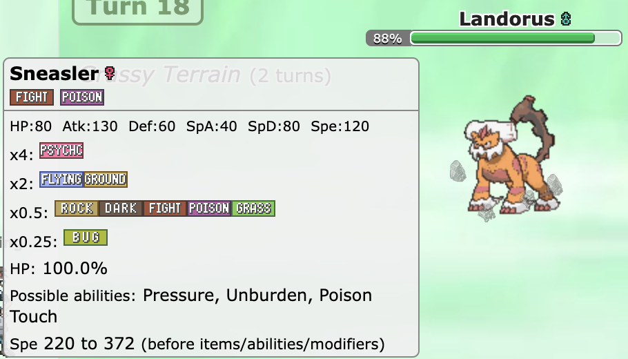
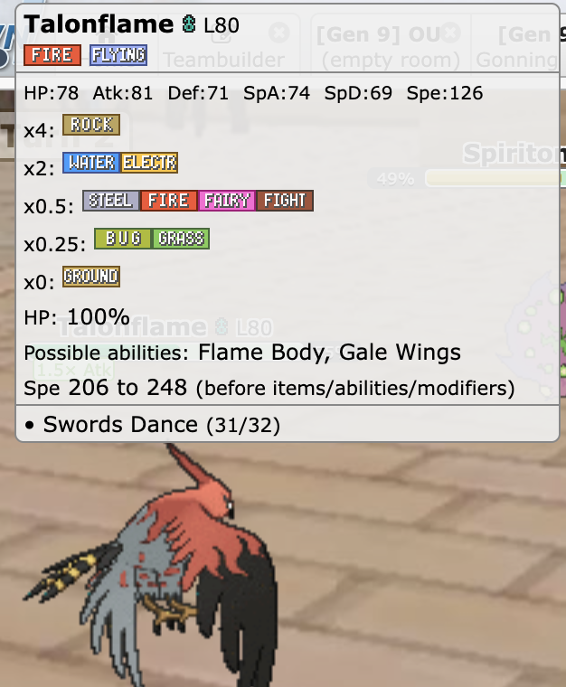

# pokemon-showdown-type-helper

Enhances Pokemon Showdown tooltips with additional information, including type weaknesses and stats.

## Screenshots




## Installation

- [Chrome Web Store](https://chrome.google.com/webstore/detail/pokemon-showdown-type-hel/ajhdnfehenofjfbajfdhjoankdheielc)
- [Add-ons for Firefox](https://addons.mozilla.org/en-US/firefox/addon/pokemon-showdown-type-helper/)

#### Build and Install from Source

1. Install dependencies and build the extension:

```bash
npm install
npm run build
# Unpacked extension is output to dist/
```

2.  Load the unpacked extension
    - [Chrome](https://developer.chrome.com/docs/extensions/mv3/getstarted/#unpacked)
    - [Firefox](https://firefox-source-docs.mozilla.org/devtools-user/about_colon_debugging/index.html#loading-a-temporary-extension)
